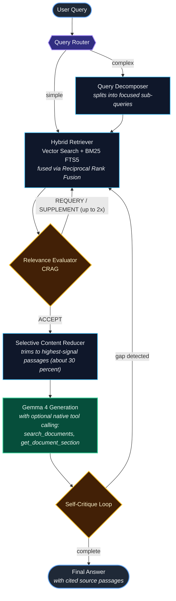

# Anvit: Local Agentic RAG

> A fully on-device AI assistant for intelligent document Q&A — powered by Gemma 4 with a multi-step agentic RAG pipeline. No cloud. No tracking. Your data stays on your device.

Anvit helps you chat with PDFs, uncover key insights, compare documents, and get clear answers grounded in your own files — whether that's research papers, study material, reports, manuals, or personal notes. It goes beyond simple document search: complex questions are decomposed into smaller steps, the most relevant passages are retrieved across multiple passes, weak results are refined, and the final answer is grounded in your library with cited sources.

Your documents, questions, and conversations never leave your phone.

**Privacy Policy:** https://likhithv02.github.io/Anvit-Privacy-Policy/

---

## Try the App

Anvit is currently in closed testing on the Play Store. To get access:

1. Join the community group using **the same Google account that is signed in to your Play Store** — this is required, otherwise the Play Store opt-in will not recognise you as a tester: **https://groups.google.com/g/anvit-ai-community/**
2. Open the first thread — it contains the Play Store opt-in link and step-by-step install instructions.

> ⚠️ The email you join the group with **must match** the email on your Play Store account. If they differ, the closed-test build will not appear as installable.

---

## Features

### Core AI
- **100% On-Device Inference** — Gemma 4 (2B or 4B) runs locally via Google LiteRT-LM; no queries are ever sent to external AI services
- **Agentic RAG Pipeline** — multi-step reasoning that decomposes complex questions, retrieves across multiple passes, and self-critiques before responding
- **Native Tool Calling** — Gemma 4 autonomously invokes document search tools mid-generation for deeper, more grounded answers
- **Thinking Mode** — chain-of-thought reasoning for complex questions
- **Self-Critique Loop** — the model evaluates its own answer for gaps and re-retrieves additional context if needed

### Retrieval
- **Hybrid Search** — combines dense vector (semantic) search with sparse BM25 full-text search via Reciprocal Rank Fusion for best-of-both coverage
- **Relevance Evaluation (CRAG)** — Corrective RAG automatically detects poor retrieval results and retries with rephrased queries or supplemental passages
- **Selective Content Reduction** — distills retrieved passages down to only what is most useful for the query, keeping the context window focused
- **Multiple Collections** — organise documents into named collections and query each independently
- **Cited Sources** — every answer includes the source document and the exact passages used to produce it

### Document & Input Support
- **PDF Ingestion** — sentence-aware chunking with configurable overlap; local embedding computed on-device
- **Multiple Embedding Models** — choose between EmbeddingGemma-300M (high quality) or Gecko-110M (faster)

### Platform & Performance
- **Android & iOS** — single Kotlin Multiplatform codebase
- **CPU & GPU Execution** — switchable hardware accelerator; GPU mode for faster inference on supported devices
- **Fully Offline After Setup** — one-time model download; the app runs completely offline thereafter
- **Session History** — persistent, searchable chat sessions with cited source passages

---

## Great For

- **Students** studying textbooks and research papers
- **Professionals** reviewing contracts, reports, and specifications
- **Researchers** querying large PDF archives
- **Anyone** who values privacy over convenience

Anvit is built as an open demonstration that powerful AI no longer requires sending your data to someone else's servers. Your phone is enough.

---

## Agentic RAG Architecture

Anvit's pipeline adapts dynamically to the complexity of each question. Every stage runs on-device.

### Key Design Decisions

| Decision | Rationale |
|---|---|
| On-device LLM only | Privacy-first — documents and queries never leave the device |
| Hybrid retrieval (vector + BM25) | Pure vector search misses exact keyword matches; BM25 alone misses semantic similarity; fusion of both consistently outperforms either alone |
| Corrective RAG (CRAG) | Prevents the model from hallucinating when retrieved chunks are irrelevant; triggers automatic re-retrieval |
| Native tool calling | Allows the LLM to drive retrieval mid-generation rather than relying solely on pre-fetched context — better for multi-hop questions |
| Self-critique post-generation | Catches incomplete answers before they reach the user and fills identified gaps in a second pass |

---

## Privacy

All AI inference, retrieval, embedding computation, and document storage happens locally on your device.

The only optional network activity is:
- **Model download** from HuggingFace (one-time, user-initiated)
- **Voluntary feedback** submission via Google Forms (only when you explicitly report an inaccuracy)

See the full privacy policy at **https://likhithv02.github.io/Anvit-Privacy-Policy/**
